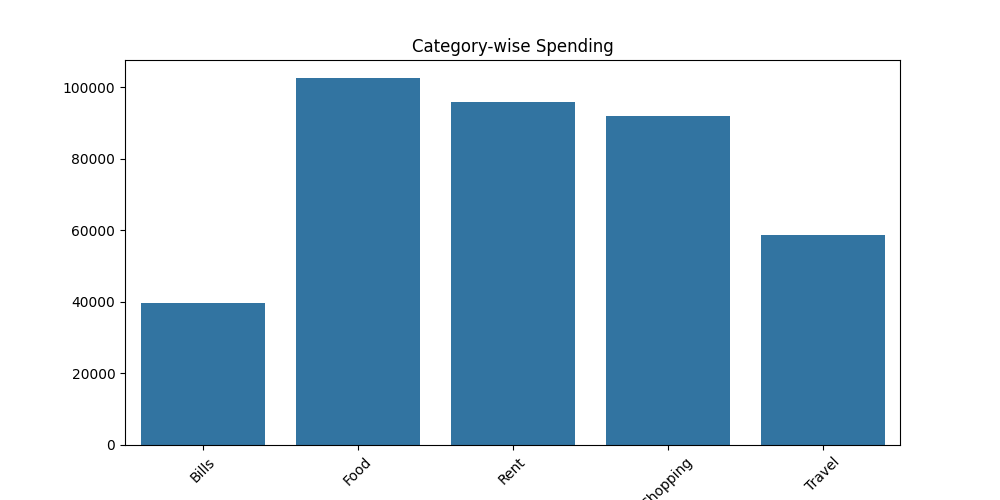
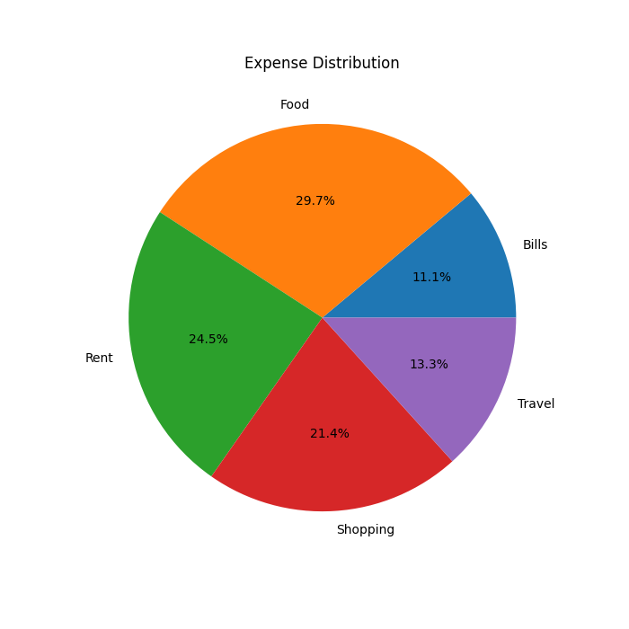

# 💰 Expense Tracker App

## 📌 Overview

This is a Data Science project that analyzes personal or synthetic expense data to track spending patterns, identify trends, and generate insights.

## 🚀 Features

* Generate synthetic expense data
* Data cleaning and preprocessing
* Category-wise spending analysis
* Monthly trend analysis
* Data visualization (Bar, Pie, Line charts)
* Interactive Streamlit dashboard

## 🛠 Tech Stack

* Python
* Pandas
* NumPy
* Matplotlib
* Seaborn
* Streamlit

## 📂 Project Structure

```
Expense-Tracker-App/
│
├── data/
├── src/
├── outputs/
├── app/
├── main.py
├── app.py
├── requirements.txt
└── README.md
```

## ▶️ How to Run

### Step 1: Install Dependencies

```
pip install -r requirements.txt
```

### Step 2: Run Backend

```
python main.py
```

### Step 3: Run Dashboard

```
streamlit run app/app.py
```

## 📊 Outputs

* Category-wise spending chart
* Expense distribution pie chart
* Monthly trend graph
* Insights on spending behavior

## 🔍 Insights Example

* Detect overspending
* Identify top expense category
* Compare income vs expense

## 📸 Screenshots

### 📊 Category-wise Spending



### 🍕 Expense Distribution



## 🔮 Future Improvements

* Budget alerts
* AI-based predictions
* Mobile app version
* Real-time expense tracking

## 👩‍💻 Author
Arshiya Muskan
